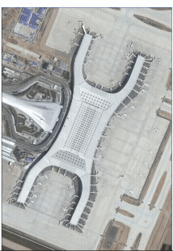
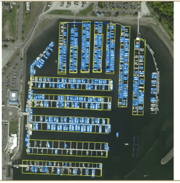
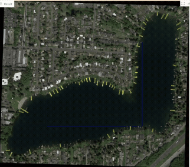
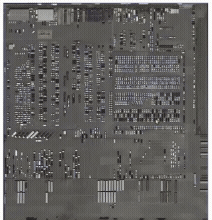
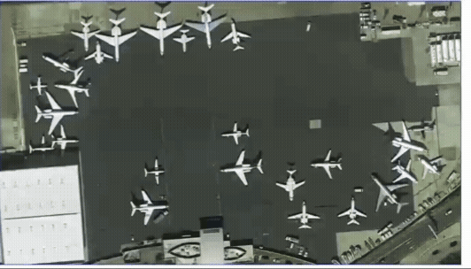

# MARS

The exponential growth of Remote Sensing (RS) technologies has transformed Earth observation,
enabling high-resolution imaging for applications like environmental monitoring, urban planning,
and disaster rescue. 
However, interpreting these images remains challenging due to their complexity, multi-scale objects,
and dense spatial-spectral information.

Inspired by the human visual system, to rapidly search and focus on important areas to extract fine details
and validate information by prior knowledge, Multi-model Agent for Remote Sensing (MARS) offers a promising solution
to interpret images in detail.

    
    
    
    
    

An Artificial Intelligence Agent (AI Agent) orchestrates a vision model (VM) and a Reinforcement Learning (RL) model,
forming the foundation for next-generation remote sensing systems.
The RL model generates observation strategies for VM to identify the class and location of objects in images by
focusing on different areas multiple times and eventually achieve the visual goal.
Experiments demonstrate the robustness of the MARS, which is size insensitive and could detect more partially obscured,
small or shadowed targets. In addition, it does not significantly increase GPU computing resources.
Code and video demos are available at https://github.com/WeijieCui/MARS.

## Dataset

The [DOTA](https://captain-whu.github.io/DOTA/dataset.html) dataset is a large-scale benchmark
designed for multi-object detection in aerial images.
It contains 2,800+ high-resolution images (800×800 to 20,000×20,000 pixels) from multiple sources
like Google Earth and satellites, with nearly 190,000 annotated object instances across 15 categories
(e.g., plane, ship, vehicle, sports fields).
This project focuses on particularly [dense images](data), mainly included small cars, big cars and ships.

Please see the [Poster](doc%2FCSMPR-F02-Poster-MARS.pdf),
[Presentation](doc%2FMARS%20Presentation.pdf)
and [Report](doc%2FCSMPR-Project%20Report-MARS.pdf) for details.

This project is also available in the GitHub repository https://github.com/WeijieCui/MARS.

## Entrance

The main entrance for MARS architecture is [app_v1.py](src%2Fapp_v1.py). 
To run this script then visit the webpage:

For more details for training and evaluating the model, please check [src/train.ipynb](src%2Ftrain.ipynb).

To make it easier, you can run this code on [colab](https://colab.research.google.com/github/WeijieCui/MARS/blob/main/src/train.ipynb).

## 🙏 Acknowledgement

Our experiments used the [DOTA](https://captain-whu.github.io/DOTA/dataset.html) dataset.

We use the structures and weights of [YOLO V11](https://docs.ultralytics.com/models/yolo11/) model in our experiments.
